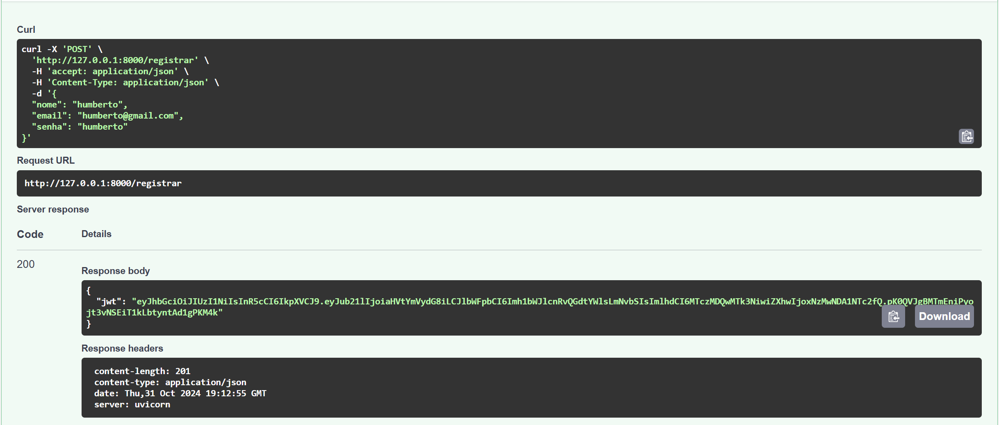
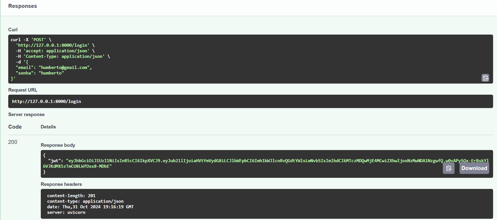
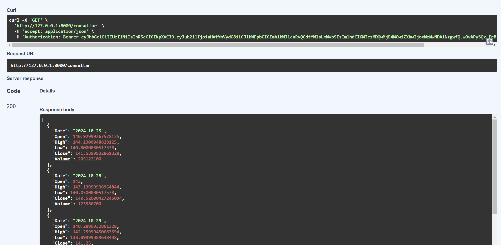

# Projeto de API Cloud

## Aluno
**Nome:** Fernando Mattos

## Descrição do Projeto

Este projeto consiste em uma API desenvolvida em FastAPI que se conecta a um banco de dados PostgreSQL e utiliza autenticação com JWT. A API possui três endpoints principais:

- **/registrar**: Cadastra um novo usuário no banco de dados, salvando o nome, email e senha em hash, e retorna um token JWT para o usuário.
- **/login**: Permite ao usuário fazer login utilizando email e senha. Se as credenciais forem válidas, o endpoint retorna um token JWT.
- **/consultar**: Endpoint protegido que retorna a cotação das ações da NVIDIA dos últimos 5 dias. Para acessá-lo, o usuário deve incluir o token JWT no header da requisição no formato `Bearer <JWT>`.

### Funcionalidade de Scraping

O endpoint `/consultar` faz uma consulta ao serviço `yfinance` para buscar a cotação das ações da NVIDIA nos últimos 5 dias, retornando os dados em formato JSON. Cada dia de negociação inclui informações detalhadas, como a data da negociação, o valor de abertura das ações, o valor máximo alcançado, o valor mínimo, o valor de fechamento no final do dia e o volume de ações negociadas. Essa integração permite que o usuário obtenha dados financeiros diretamente pela API.

## Como Executar a Aplicação

### Pré-requisitos

- Docker e Docker Compose instalados na máquina.

### Passos para Execução

1. **Clonar o Repositório**:

   ```bash
   git clone <https://github.com/FernandoMattos16/Cloud-Project.git>
2. Dentro da pasta do repositório, crie um `.env` na raiz do projeto, seguindo o modelo em `.env.example`:

    ```bash
    DATABASE_HOST="db"
    POSTGRES_DB="nome_do_banco"
    POSTGRES_USER="seu_usuario"
    POSTGRES_PASSWORD="sua_senha"
    SECRET_KEY="sua_chave_secreta"
**OBS:** Para gerar a secret key rode o arquivo `secret_key_generate.py` 

3. **Executar o Docker Compose**

    ```bash
    docker compose up
A API estará acessível em http://127.0.0.1:8000

## Documentação dos Endpoints

1. `/registrar` (POST)
* **Descrição**: Registra um novo Usuário e retorna um token JWT.
* **Parâmetros**:
    * `nome` (string): Nome do usuário
    * `email` (string): Email do usuário
    * `senha` (string): Senha do usuário
* **Resposta** (JSON):
    * `{ "jwt": "<token_jwt>" }`

2. `/login`(POST) 
* **Descrição**: Autentica o usuário e retorna op token JWT.
* **Parâmetros**:
    * `email` (string): Email do usuário
    * `senha` (string): Senha do usuário
* **Resposta** (JSON):
    * `{ "jwt": "<token_jwt>" }`

3. `/consultar` (GET)
* **Descrição**: Retorna a cotação das ações da NVIDIA nos últimos 5 dias
* **Cabeçalho**: Authorization: Bearer <JWT>
* **Resposta** (JSON):

    ```bash
    [
    {'Date': '2024-10-25', 
    'Open': 140.92999267578125, 
    'High': 144.1300048828125, 
    'Low': 140.8000030517578, 
    'Close': 141.5399932861328, 
    'Volume': 205122100.0}, 
    {'Date': '2024-10-28', 
    'Open': 143.0, 
    'High': 143.13999938964844, 
    'Low': 140.0500030517578, 
    'Close': 140.52000427246094
    ...
    ]
## Screenshot dos Endpoints Testados

1. `/registrar`:



2. `/login`:



3. `/consultar`:




## Vídeo de Execução da Aplicação

* Link para o vídeo: [Vídeo de Execução da API](https://youtu.be/pScoMMRsNUo)

## Link para o Docker Hub do Projeto

A imagem Docker deste projeto está disponível no Docker Hub e pode ser acessada através do link:

* [femattos/apicloud no Docker Hub](https://hub.docker.com/r/femattos/apicloud)

Para baixar a imagem diretamente do Docker Hub, use o comando:

    docker pull femattos/apicloud:latest